# **Gladiator King**
Gladiator King is a Python terminal game, which runs in the terminal on Heroku.
The player gets to build a character and then face a gladiator. The player can choose to play again after the battle is done and build a new character and face another gladiator.   

**Link to the website:** 
https://gladiator-king.herokuapp.com/

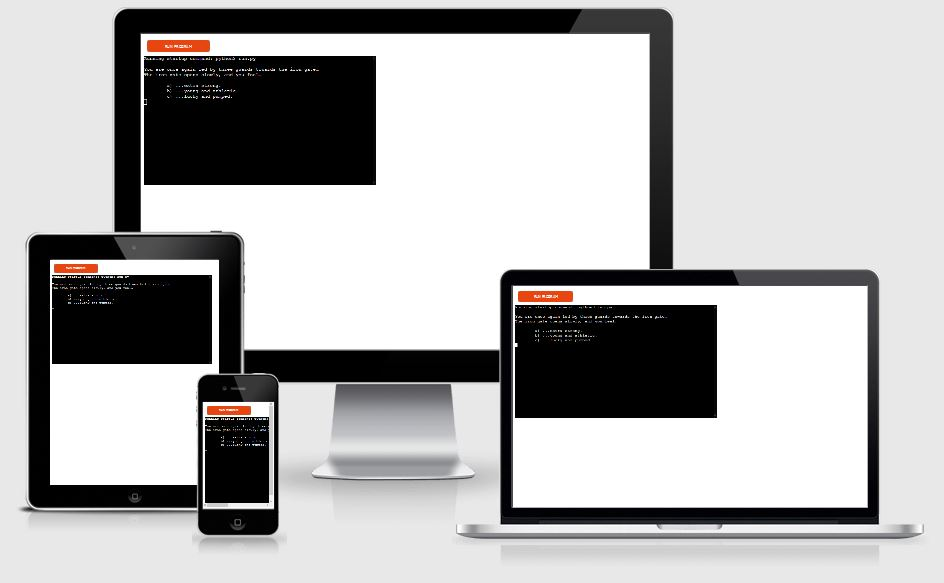
***

## **How to play**
The player starts the game by making different choices, like choosing a weapon etc. When the selections are made, the player must face his opponent. 
During the fight, the player must choose an attack to do, and if he is lucky enough, he hits his opponent. Then it's the opponents turn to attack. The character who survives the battle - is the winner.

## **Features**
---

### **Create Character** 
When the game starts, the player creates a characther by answering some questions. The answer to these questions will set the player attributes, like health for example.

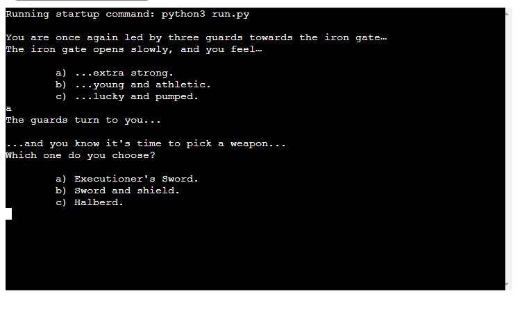

### **Random Generated Enemy**
The enemy get a random generated name, with random generated attributes, and the enemy has a chance to become an elite enemy.

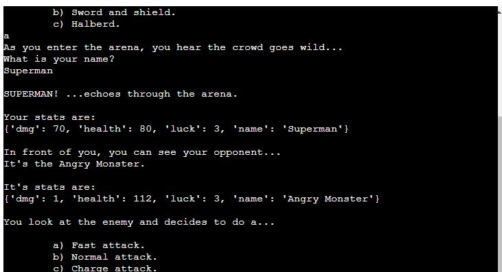

### **Random Generated Elite Enemy**
The enemy has a chance to become an elite enemy with higher attributes and a special attack.

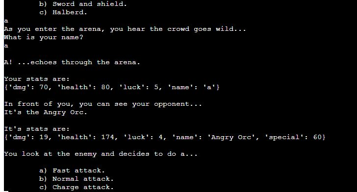

### **Accepts user input**
The player must enter his name and make some choices in the game. If the player does not enter the correct input, the game tells the player what to do.

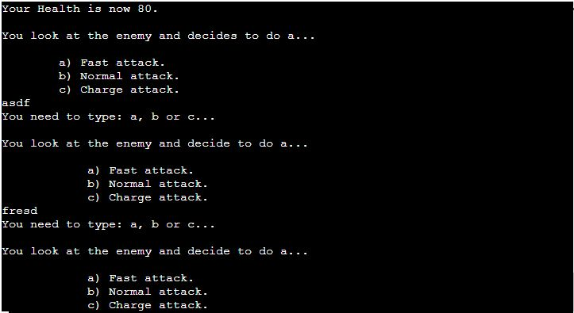

### **Maintains Health**
The game keeps track of the player's and enemy's health, and shows it after every attack.

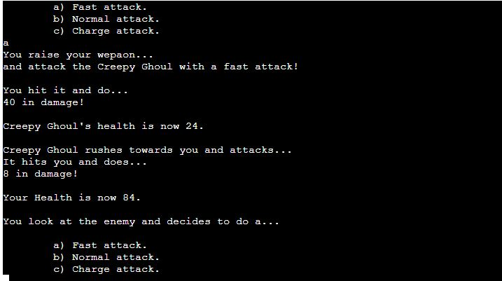

### **Player Attack**
The player can choose between three different attacks. After the choice - the game then calculates the player's chance of hitting, and if it's too low the player misses.

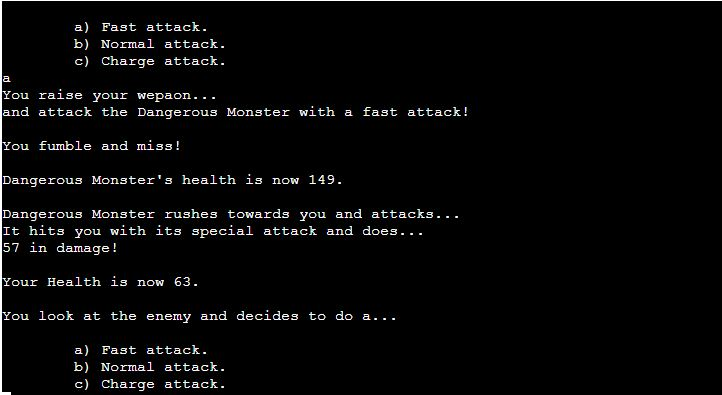

### **Enemy Attack**
The game calculates the enemy's chance to hit the player. If it is too low, the enemy will miss. If it is an elite enemy, it has a chance to attack with its special attack - wich does much more damage to the player.

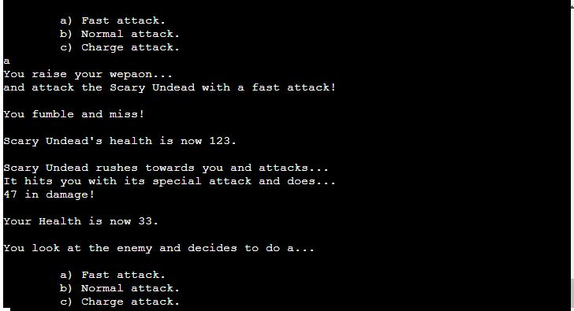

### **Battle**
When the battle is on, the player and the enemy fight until someone is dead.

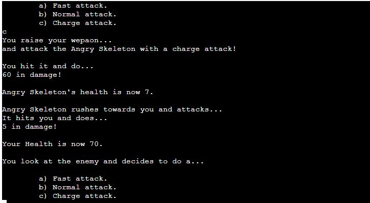

### **Play Again**
When the player is dead, or the player has defeated the enemy, the player has a choice to play another match or leave the game.

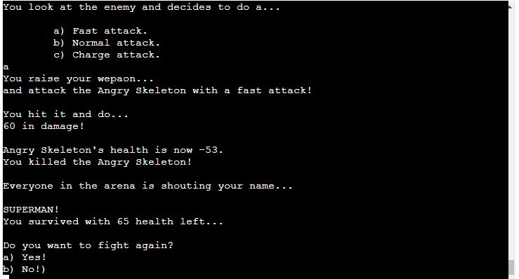

## **Future plans for this project**
- Add a function so the player can fight as many enemies he can until he dies.
- Add more enemy classes.
- Add more weapons.
- Add different attacks - that manipulates the players attributes. 

---
## **UX**
---

### **User Story**
A player wants to challenge himself and kill as many opponents as he can. The player wants to learn the game, and make the best choices to never lose a fight.

### **Goals For Game Owners** 
The goal of this project is to entertain the player with a roguelike game. The game gives the player various choices that affect the game. When the player leaves the game, the player will think about how he can defeat more opponents.

### **Flow Chart** ###

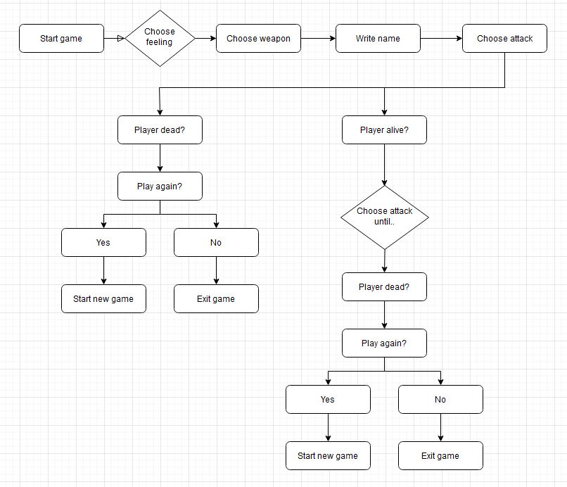
***

## **Testing And Validation**
---

**PEP8** - No errors were detected with PEPonline.com.

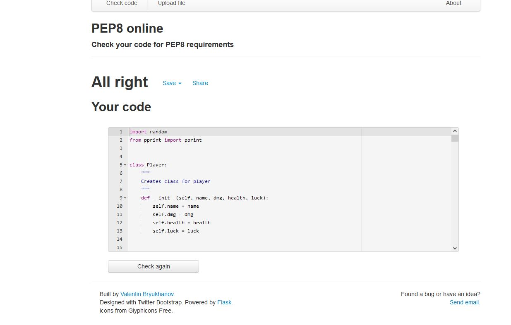

## **Bugs** ##
---

No bugs were detected.

### **Unfixed bugs** ###

No unfixed bugs.
***

## **Technologies Used** ##
---

### **Languages** ##
- Python

### **Programs** ###
- Gitpod: Used for writing code.
- Git: Used for version-control.
- GitHub: Used for store data and hosting platform.
- Heroku: Used for deployment.
***

## **Deployment** ##
---

The project was deployed using Codes Institite's template and with Heroku.
Steps to deployment:
- Create new Heroku app
- Set the buildbacks to Python and NodeJS in this order
- Link Heroku to your repository
- Click on deploy

Link to the website: https://gladiator-king.herokuapp.com/
***

## **Credits** ##
---
- Credit to my my mentor, Brian O'Hare - for helping me clarifying the structure. 
- Credit to the Code Institute's tutor support - for helping me solving a few questions. 
- To complete this project, I used Code Institute's student template: https://github.com/Code-Institute-Org/python-essentials-template

